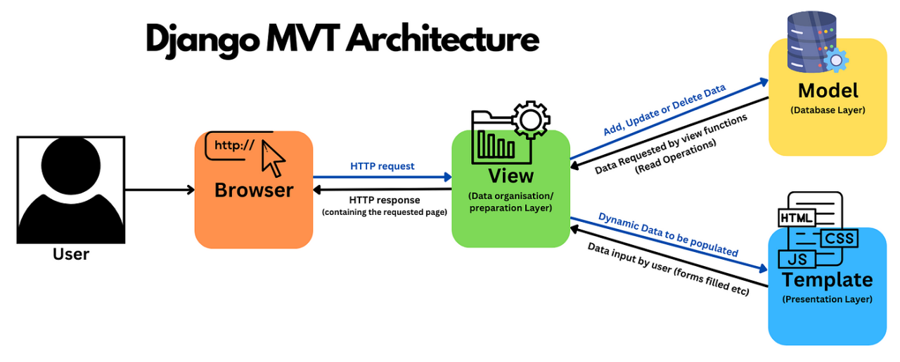

# Introduction to Django and Setting Up the Project 

- Theoretical part:
  - Django frameworkiga kirish va asosiy tushunchalar
  - Django'ni o'rnatish va yangi loyiha yaratish
- Practical part:
  - Django loyihasini yaratish: `django-admin startproject ecommerce`
  - Django serverini ishga tushirish
  - App yaratish: `python manage.py startapp store`

> [!NOTE]
> Django – bu Python tilida yozilgan, veb-ilovalarni tez va samarali ishlab chiqish uchun mo‘ljallangan yuqori darajali web-framework. Django keng qo‘llaniladigan framework, chunki undan ko'p standart funksiyalar bor va dasturchilarni kamroq kod yozishiga yordam beradi.

## Django Frameworkning Afzalliklari

1. **Speed**: Django dasturchilarga loyihani qisqa vaqt ichida yaratish imkonini beradi.
2. **Simplicity and Clean Code**: Djangoning sintaksisi sodda va toza.
3. **Built-in Features**: 
   - Ma'lumotlar bazasi bilan ishlash (ORM – Object Relational Mapper).
   - Foydalanuvchi autentifikatsiyasi.
   - Admin paneli.
   - Xavfsizlik (XSS, CSRF kabi hujumlardan himoya).
4. **Flexibility**: Har qanday turdagi loyihalar uchun mos – kichik loyihalardan yirik korporativ tizimlargacha.
5. **Large Community and Excellent Documentation.**

## Django Arxitekturasi

Django **MVC (Model-View-Controller)** yoki **MTV (Model-Template-View)** arxitekturasiga asoslangan:

1. **Model**: Ma'lumotlar bazasi bilan ishlovchi qism. Model orqali ma'lumotlar strukturalari yaratiladi.
2. **Template**: Foydalanuvchi interfeysi uchun `HTML/CSS` kodlarni o‘z ichiga oladi.
3. **View**: Biznes logikasini ta'minlaydi va foydalanuvchi so‘rovlariga javob qaytaradi.

## Django Loyihasining Tuzilishi

