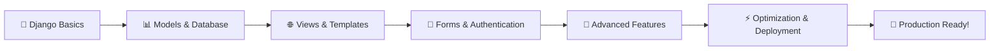

# 🚀 Django Web Framework - To'liq O'zbek Tilidagi Kurs

<div align="center">


### 🎓 Professional Django Development Course
**O'zbek tilida | Beginner-Friendly | Production-Ready**

[Boshlash](#-quick-start) • [Darslar](#-darslar-reyxati) • [Loyihalar](#-amaliy-loyihalar) • [Yordam](#-yordam)

</div>

---

## 📖 Kurs Haqida

Django - zamonaviy va kuchli Python web framework. Bu kurs sizga Django'ni **noldan professional darajagacha** o'rgatadi. Barcha darslar **o'zbek tilida**, **amaliy misollarda** va **real-world loyihalarda** tushuntirilgan.

### ✨ Kursning O'ziga Xosligi

```python
class DjangoCourse:
    def __init__(self):
        self.language = "O'zbek tili 🇺🇿"
        self.level = "Beginner to Advanced"
        self.format = "Theory + Practice + Projects"
        self.duration = "24 dars"
        self.support = "Full documentation"
    
    def benefits(self):
        return [
            "✅ To'liq o'zbek tilidagi tushuntirishlar",
            "✅ Har bir darsda amaliy kod misollari",
            "✅ Real-world loyihalar",
            "✅ Production-ready best practices",
            "✅ Step-by-step yo'riqnomalar",
        ]
```

---

## 🎯 Kimlar Uchun?

| 👨‍🎓 Yangi Boshlovchilar | 💼 Dasturchilar | 🚀 Advanced |
|:---:|:---:|:---:|
| Python bilasiz va web development boshlashni xohlaysiz | Django'ni professional darajada o'rganishni istaysiz | Production-ready skills va best practices kerak |

---

## 🗺️ O'quv Yo'l Xaritasi



---

## 📚 Darslar Ro'yxati

### 📘 QISM 1: Django Asoslari (0-4 Darslar)

<table>
<tr>
<td width="50%">

#### 🟢 Boshlang'ich
- **00** - [Django'ga Kirish](00-Introduction%20to%20Django)
  - `Django nima?` `Nima uchun Django?` `Virtual environment`
- **01** - [Loyiha Strukturasi](01-Django%20Project%20Structure)
  - `Project yaratish` `Apps` `Settings` `Manage.py`
- **02** - [URL va Views](02-URL%20Dispatcher%20and%20Views)
  - `URL Dispatcher` `Function-based views` `Routing`

</td>
<td width="50%">

#### 🟡 Davom
- **03** - [Templates](03-Templates%20%28Working%20with%20HTML%29)
  - `Template Engine` `Template Tags` `Filters` `Inheritance`
- **04** - [Static Files & Bootstrap](04-Static%20Files%20and%20Bootstrap)
  - `CSS/JS` `Bootstrap 5` `Icons` `Fonts`

</td>
</tr>
</table>

### 📗 QISM 2: Database va Models (5-9 Darslar)

<table>
<tr>
<td width="50%">

#### 🔵 Database Basics
- **05** - [Django ORM & Models](05-Django%20ORM%20and%20Models)
  - `Models` `Migrations` `Fields` `Relationships`
- **06** - [Admin Panel](06-Django%20Admin%20Panel)
  - `Admin customization` `ModelAdmin` `Actions`
- **07** - [Django Forms](07-Django%20Forms)
  - `Forms` `ModelForm` `Validation` `Widgets`

</td>
<td width="50%">

#### 🟣 Advanced Database
- **08** - [CRUD Operations](08-CRUD%20Operations)
  - `Create` `Read` `Update` `Delete` `Views`
- **09** - [QuerySet & Filtering](09-QuerySet%20and%20Filtering)
  - `QuerySet API` `Filtering` `Aggregation` `Q objects`

</td>
</tr>
</table>

### 📕 QISM 3: Advanced Features (10-14 Darslar)

<table>
<tr>
<td width="50%">

#### 🟠 User Management
- **10** - [Authentication System](10-Django%20Authentication%20System)
  - `Login/Logout` `Registration` `Permissions` `Groups`
- **11** - [Middleware & Sessions](11-Middleware%20and%20Sessions)
  - `Custom Middleware` `Session` `Cookies` `Cart`
- **12** - [Class-Based Views](12-Class-Based%20Views%20%28CBV%29)
  - `CBV` `Generic Views` `Mixins` `CRUD CBV`

</td>
<td width="50%">

#### 🔴 UI & Files
- **13** - [Messages Framework](13-Django%20Messages%20Framework)
  - `Flash Messages` `Alert` `Toast` `Notifications`
- **14** - [File Upload & Media](14-File%20Upload%20and%20Media%20Files)
  - `ImageField` `FileField` `Upload` `Validation`

</td>
</tr>
</table>

### 📙 QISM 4: Real Project (15-19 Darslar)

<table>
<tr>
<td width="50%">

#### 🎨 Project Building
- **15** - [Project Planning](15-Project%20Planning)
  - `Requirements` `ERD` `Database Design` `Planning`
- **16** - [Models & Database](16-Building%20Models%20and%20Database)
  - `Blog Models` `Admin Setup` `Test Data`
- **17** - [Frontend Design](17-Designing%20the%20Frontend)
  - `Bootstrap` `Templates` `Navbar` `Footer`

</td>
<td width="50%">

#### ⚙️ Functionality
- **18** - [Authentication & Users](18-Authentication%20and%20User%20Pages)
  - `Register` `Login` `Profile` `Password Reset`
- **19** - [Management Commands](19-Custom%20Management%20Commands)
  - `Custom Commands` `Data Generation` `Automation`

</td>
</tr>
</table>

### 📔 QISM 5: Production Ready (20-24 Darslar)

<table>
<tr>
<td width="50%">

#### 🧪 Testing & Quality
- **20** - [Testing Applications](20-Testing%20Django%20Applications)
  - `Unit Tests` `Integration Tests` `Coverage` `TDD`
- **21** - [Custom Error Pages](21-Custom%20Error%20Pages%20%28404%2C%20500%29)
  - `404 Page` `500 Page` `Error Handling` `Logging`
- **22** - [Django Caching](22-Django%20Caching%20%28Basic%29)
  - `Cache Backends` `Per-view` `Template Fragment` `Redis`

</td>
<td width="50%">

#### 🚀 Production
- **23** - [Internationalization](23-Django%20Internationalization%20%28i18n%29)
  - `i18n` `Translation` `Multi-language` `Localization`
- **24** - [Deployment & Finalization](24-Deployment%20and%20Finalization)
  - `Production Settings` `Security` `Gunicorn` `Nginx`

</td>
</tr>
</table>

---

## 🏗️ Amaliy Loyihalar

Kurs davomida quyidagi real-world loyihalarni yaratamiz:

### 1️⃣ Blog Platform (15-19 Darslar)
```
✨ Features:
├── 👤 User Authentication (Register, Login, Profile)
├── 📝 Post Management (CRUD)
├── 📁 Categories & Tags
├── 💬 Comment System
├── ❤️ Like System
├── 🔍 Search & Filter
└── 📱 Responsive Design
```

### 2️⃣ Advanced Features
- ✅ File Upload & Media Management
- ✅ Admin Panel Customization
- ✅ Email Notifications
- ✅ Multi-language Support
- ✅ Caching & Performance
- ✅ Production Deployment

---

## 🚀 Quick Start

### Prerequisites
```bash
# Python 3.11+
python --version

# pip
pip --version
```

### Installation

```bash
# 1. Virtual environment yaratish
python -m venv venv

# 2. Activate qilish
# Windows:
venv\Scripts\activate
# Linux/Mac:
source venv/bin/activate

# 3. Django o'rnatish
pip install django

# 4. Loyiha yaratish
django-admin startproject myproject
cd myproject

# 5. Serverni ishga tushirish
python manage.py runserver
```

### 🎉 Tayyor!
Brauzeringizda `http://127.0.0.1:8000` ga kiring

---

## 💡 Har Bir Darsda

<table>
<tr>
<td width="33%" align="center">

### 📖 Nazariya
Tushuntirishlar va konseptlar

</td>
<td width="33%" align="center">

### 💻 Amaliyot
To'liq kod misollari

</td>
<td width="33%" align="center">

### 🎯 Topshiriqlar
Practice tasks (Easy/Medium/Hard)

</td>
</tr>
</table>

---

## 🛠️ Technologies Stack

<div align="center">

| Frontend | Backend | Database | Tools |
|:---:|:---:|:---:|:---:|
|  |  |  |  |
|  |  |  |  |
|  |  |  |  |

</div>

---

## 📊 Kurs Statistikasi

<div align="center">

```
📚 24 darslar    |    💻 500+ kod misollari    |    🎯 72 amaliy topshiriq    |    🚀 2 to'liq loyiha
```

</div>

---

## 🤝 Qo'llab-Quvvatlash

### 💬 Savollaringiz bormi?

- 📧 Email: support@deepcodeacademy.uz
- 💬 Telegram: [@deepcodeacademy](https://t.me/deepcodeacademy)
- 🌐 Website: [deepcodeacademy.uz](https://deepcodeacademy.uz)

### 🐛 Bug Report
Agar xato topsangiz, [Issues](../../issues) bo'limida xabar bering.

---

## 📜 License

MIT License - Code bilan istalgancha ishlay olasiz!

---

## 🌟 Contributing

Contributions are welcome! Agar kursni yaxshilash bo'yicha takliflaringiz bo'lsa:

1. Fork qiling
2. Feature branch yarating (`git checkout -b feature/AmazingFeature`)
3. Commit qiling (`git commit -m 'Add some AmazingFeature'`)
4. Push qiling (`git push origin feature/AmazingFeature`)
5. Pull Request oching

---

## 📈 Roadmap

- [x] Django Basics (0-9)
- [x] Advanced Features (10-14)
- [x] Real Project (15-19)
- [x] Production Ready (20-24)
- [ ] Django REST Framework Course
- [ ] Django Channels (WebSockets)
- [ ] Celery (Background Tasks)
- [ ] Docker & Kubernetes

---

## 💖 Support the Project

Agar kurs foydali bo'lsa, ⭐ **star** bosishni unutmang!

<div align="center">

### 🎓 Happy Learning! 🚀

**Deepcode Academy** | *Professional Django Development*

---

**Made with ❤️ in Uzbekistan 🇺🇿**

</div>